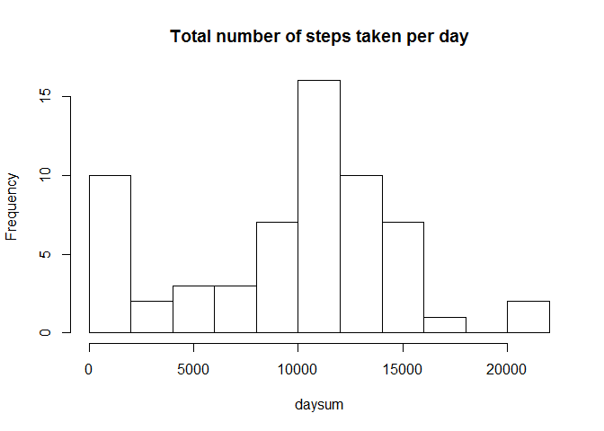
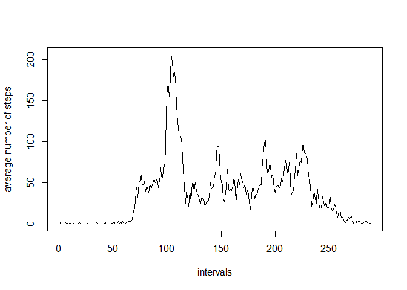
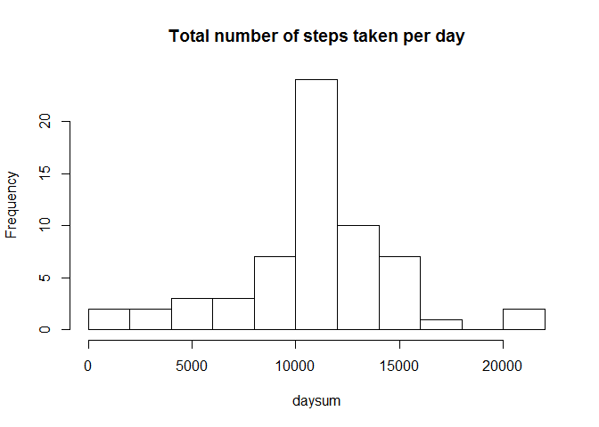
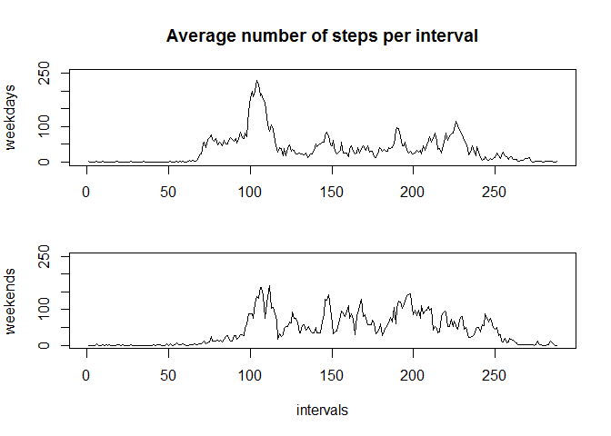

# Reproducible Research: Peer Assessment 1


## Loading and preprocessing the data

Loading data from the csv file:

```r
data <- read.csv("activity.csv")
```

Rearranging data into a more suitable format:

```r
library(reshape)
datacast <- cast(data,interval~date,value='steps')
```


## What is mean total number of steps taken per day?

In this part we ignore missing values.
A histogram of the total number of steps taken each day:

```r
daysum <- apply(datacast[,2:62],2,function(x) sum(x,na.rm=TRUE))
hist(daysum,10,main="Total number of steps taken per day")
```

 

Mean  total number of steps taken per day:

```r
mean(daysum)
```

```
## [1] 9354.23
```

Median total number of steps taken per day:

```r
median(daysum)
```

```
## [1] 10395
```


## What is the average daily activity pattern?

Average number of steps per interval:

```r
intmeans <- apply(datacast[,2:62],1,function(x) mean(x,na.rm=TRUE))
intervals <- 1:length(intmeans)
plot(intervals,intmeans,type="l",ylab="average number of steps")
```

 

The interval with the maximum average number of steps:

```r
which(intmeans==max(intmeans))
```

```
## [1] 104
```

## Imputing missing values

The total number of missing values:

```r
sum(is.na(data))
```

```
## [1] 2304
```

The strategy for imputing missing data is that all the missing values of steps will be replaced with the average number of steps for corresponding intervals.

Replacing each missing value with the average for the interval:

```r
filler <- rep(intmeans,61)
data[is.na(data$steps),1] <- filler[is.na(data$steps)]
datacast <- cast(data,interval~date,value='steps')
```

A histogram of the total number of steps taken each day:

```r
daysum <- apply(datacast[,2:62],2,function(x) sum(x,na.rm=TRUE))
hist(daysum,10,main="Total number of steps taken per day")
```

 

Mean  total number of steps taken per day:

```r
mean(daysum)
```

```
## [1] 10766.19
```

Median total number of steps taken per day

```r
median(daysum)
```

```
## [1] 10766.19
```

The impact of replacing all the missing values with average values for intervals is clearly visible. The form of the distribution of the total number of steps taken every day now is closer to normal, without an extra maximum in the first interval, that appeared due to the missing values, which made sums of steps for some days smaller.

## Are there differences in activity patterns between weekdays and weekends?

Separating data for the two levels of the (weekdays,weekend) factor:

```r
Sys.setlocale("LC_TIME", "English")
```

```
## [1] "English_United States.1252"
```

```r
try <- factor(weekdays(as.POSIXct(data$date)))

lev = rep("weekday",7)
lev[which(levels(try)=="Saturday")] = "weekend"
lev[which(levels(try)=="Sunday")] = "weekend"
levels(try) <- lev

data[,4] <- try

sep <- by(data,data$V4,function(x) cast(x,interval~date,value='steps'))
wddata <- sep[[1]]
wedata <- sep[[2]]
```

Plotting daily activity for weekdays and weekends:


```r
par(mfrow=c(2,1))
par(mar=c(3, 4, 4, 2))
intmeans <- apply(wddata[,2:length(wddata)],1,function(x) mean(x,na.rm=TRUE))
plot(intervals,intmeans,type="l",xlab="",ylab="weekdays",ylim=c(0,250))
title(main="Average number of steps per interval");
par(mar=c(5, 4, 2, 2))
intmeans <- apply(wedata[,2:length(wedata)],1,function(x) mean(x,na.rm=TRUE))
plot(intervals,intmeans,type="l",xlab="intervals",ylab="weekends",ylim=c(0,250))
```

 
